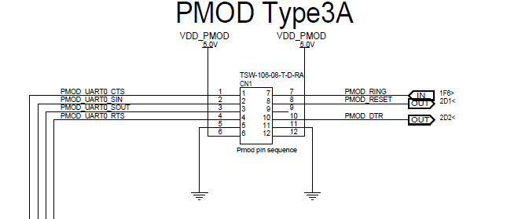
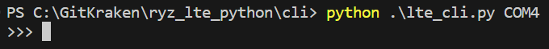
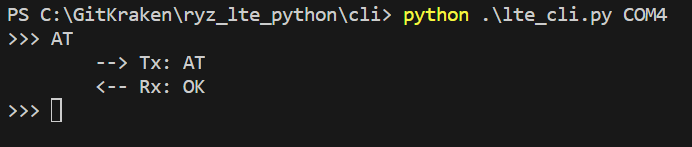
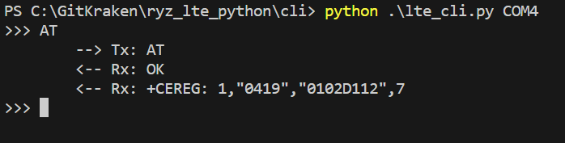
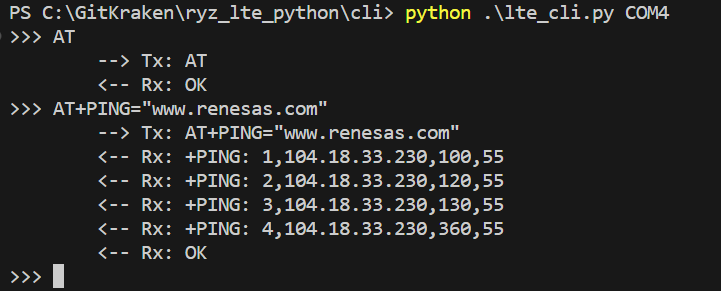

# lte_cli.py

A simple CLI for sending AT commands to an RYZ014A/RYZ024A.

> **_NOTE:_** Note this script requires the [prompt_toolkit](https://pypi.org/project/prompt-toolkit/) library. `prompt_toolkit` is used to provide a more user friendly CLI.

Using a terminal program such as Tera Term to send AT commands can be cumbersome as every character is transmitted as soon as it is typed into the terminal. This can lead to poorly formatted commands do to typos. In addition, it is not easy to re-transmit a commmand you have already sent without copying/pasting into the terminal. Finally, asynchronus responses that occur while you are entering a command can make it difficult to review the history of communication with the modem.

This application seeks to allieviate those issues.

## Hardware Setup

This example requires a PMOD expansion board for [RYZ024A](https://www.renesas.com/us/en/products/wireless-connectivity/cellular-iot-modules/rtkyz024a0b00000be-pmod-expansion-board-ryz024a) or [RYZ014A](https://www.renesas.com/us/en/products/wireless-connectivity/cellular-iot-modules/rtkyz014a0b00000be-pmod-expansion-board-ryz014a).

In addition, a USB to UART converter is required to send AT commands from your PC to the PMOD expansion board over the USB port of your PC.

The UART_TX, UART_RX, and GND pins of your USB to UART converter should be connected to PMOD expansion board. In addition, connect the UART_CTS and UART_RTS pins if you are using UART flow control.

> **_NOTE:_** It is recommended to use flow control to prevent loss of data

Finally, power can be applied to the PMOD expansion board either by connecting to the micro USB connector or by applying 5V to the PMOD interface.

Below is the pinout of the PMOD:

## Running the script

You can run the script with:

`python lte_cli.py <com_port>`

where `<com_port>` is the COM port associated with your USB to serial converter.

To run with flow control enabled on the serial port use:

`python lte_cli.py --flow_cntrl <com_port>`

Once running, you will be provided with a prompt:

Here you can type any AT commands you wish to send to the modem. The command will not actually be transmitted until you press `Enter`, allowing you to fix any typos in your command before it is transmitted.

When you send a command, you will see an indication that the command was transmitted, as well as the response from the modem.

In addition, any asynchronus messages from the modem will not destroy the command line interface. Below `+CEREG...` was received asynchronusly:

This is useful for commands that receive responses asynchronusly. Below is an example of sending the PING command:

The prompt_toolkit library also keeps an input history for consecutive calls to `PromptSession().prompt()`. If you would like to send the same command again, simply press the up arrow until you find your desired command in your history. 

For additional information on AT commands for the RYZ014A/RYZ024A, please refer to the below manuals: 

[AT Command User Manual](https://www.renesas.com/us/en/document/mah/ryz024-modules-command-users-manual?r=1636901)

[Use Cases for AT Commands](https://www.renesas.com/us/en/document/apn/ryz024a-use-cases-commands?r=1636861)
