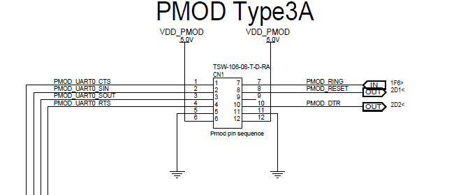
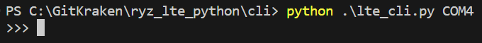
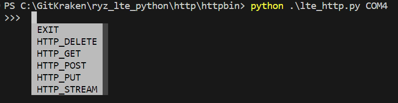
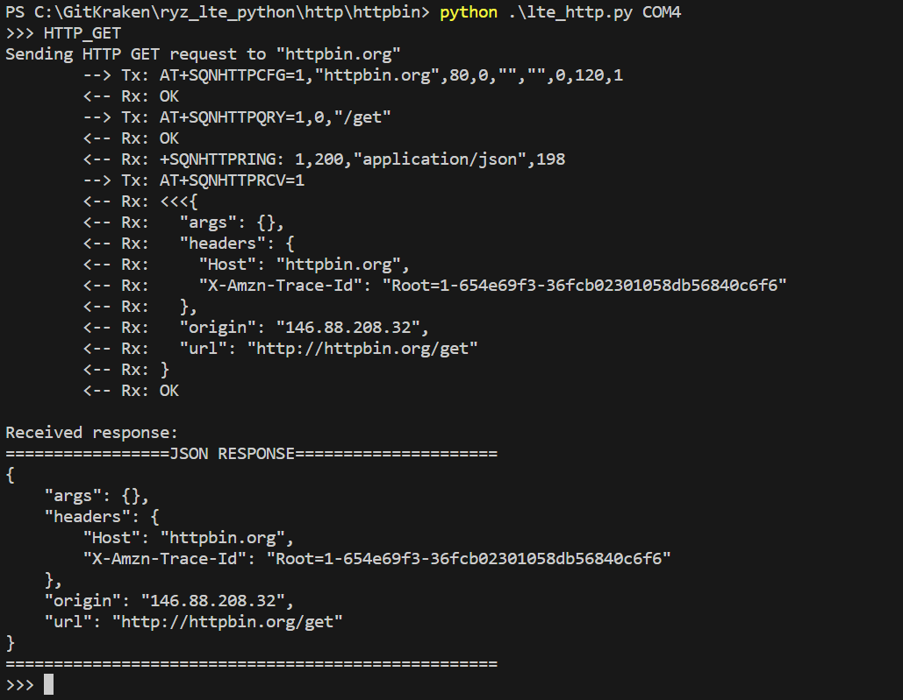
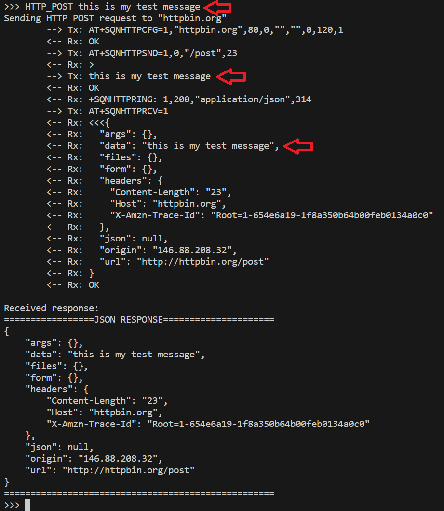
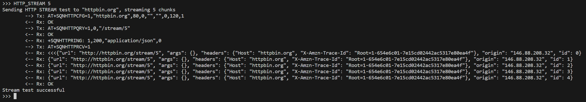

# lte_http.py

A simple script for sending HTTP commands to httpbin.org.

The purpose of this script is to demonstrate sending HTTP requests via AT commands.

## Hardware Setup

This example requires a PMOD expansion board for [RYZ024A](https://www.renesas.com/us/en/products/wireless-connectivity/cellular-iot-modules/rtkyz024a0b00000be-pmod-expansion-board-ryz024a) or [RYZ014A](https://www.renesas.com/us/en/products/wireless-connectivity/cellular-iot-modules/rtkyz014a0b00000be-pmod-expansion-board-ryz014a).

In addition, a USB to UART converter is required to send AT commands from your PC to the PMOD expansion board over the USB port of your PC.

The UART_TX, UART_RX, and GND pins of your USB to UART converter should be connected to PMOD expansion board. In addition, connect the UART_CTS and UART_RTS pins if you are using UART flow control.

> **_NOTE:_** It is recommended to use flow control to prevent loss of data

Finally, power can be applied to the PMOD expansion board either by connecting to the micro USB connector or by applying 5V to the PMOD interface.

Below is the pinout of the PMOD:

## Running the script

You can run the script with:

`python lte_http.py <com_port>`

where `<com_port>` is the COM port associated with your USB to serial converter.

To run with flow control enabled on the serial port use:

`python lte_http.py --flow_cntrl <com_port>`

Once running, you will be provided with a prompt:

Here you can initiate various HTTP requests by entering the corresponding command:

Once you enter a command, the appropriate AT commands will be issued to the modem to complete the action. A message sequence chart will be printed to the terminal illustrating the AT commands used
and the corresponding responses from the modem. Finally, the JSON response for the request will be printed. An example of the `HTTP_GET` command is below:

The `HTTP_POST` and `HTTP_PUT` commands allow you to send a custom message with the request. The `HTTP_POST` request is illustrated below:

The `HTTP_STREAM` command allows to specify how many chunks to stream. An example is illustrated below: 

