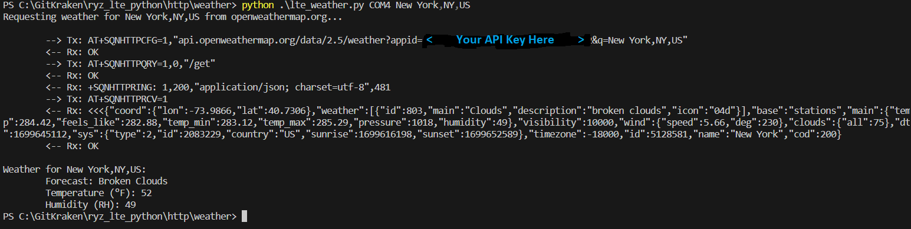
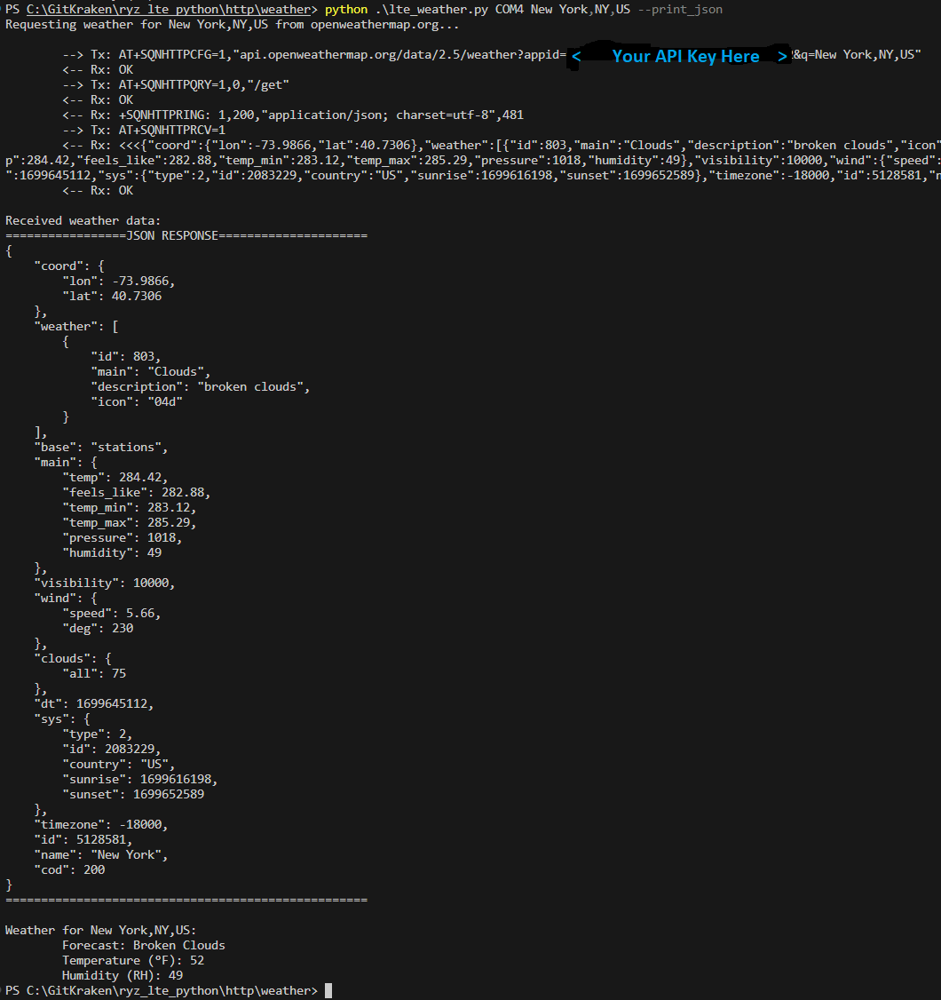

# lte_weather.py

A simple script for retreiving weather data from www.openweathermap.org.

The purpose of this script is to demonstrate sending HTTP requests via AT commands.

> **_NOTE:_** This script requires an API key, you can obtain one for free from [OpenWeather](https://openweathermap.org/appid).

## Hardware Setup

This example requires a PMOD expansion board for [RYZ024A](https://www.renesas.com/us/en/products/wireless-connectivity/cellular-iot-modules/rtkyz024a0b00000be-pmod-expansion-board-ryz024a) or [RYZ014A](https://www.renesas.com/us/en/products/wireless-connectivity/cellular-iot-modules/rtkyz014a0b00000be-pmod-expansion-board-ryz014a).

In addition, a USB to UART converter is required to send AT commands from your PC to the PMOD expansion board over the USB port of your PC.

The UART_TX, UART_RX, and GND pins of your USB to UART converter should be connected to PMOD expansion board. In addition, connect the UART_CTS and UART_RTS pins if you are using UART flow control.

> **_NOTE:_** It is recommended to use flow control to prevent loss of data

Finally, power can be applied to the PMOD expansion board either by connecting to the micro USB connector or by applying 5V to the PMOD interface.

Below is the pinout of the PMOD:

## Running the script

Before running the script, ensure you update the `OPEN_WEATHER_API_KEY` variable with your API key.

You can run the script with:

`python lte_weather.py <com_port> <location>`

where `<com_port>` is the COM port associated with your USB to serial converter and `<location>` is the location to retreive weather data for.

To run with flow control enabled on the serial port use:

`python lte_http.py --flow_cntrl <com_port> <location>`

To print the full JSON response from `OpenWeather` to the terminal use:

`python lte_http.py --print_json <com_port> <location>`

The script will automatically issue the appropriate AT commands to request weather data.. A message sequence chart will be printed to the terminal illustrating the AT commands used
and the corresponding responses from the modem. Finally, weather data for the location of interest will be printed to the terminal:

If the `--print_json` option is used, the full JSON response from `OpenWeather` will be printed to the terminal as well.

