# lte_mqtt.py

A simple script for sending MQTT commands to test.mosquitto.com.

The purpose of this script is to demonstrate publishing and subscribing to MQTT topcis.

The [Mosquitto MQTT Broker](https://mosquitto.org/) is used to demonstrate transmission/reception of MQTT messages from the modem. You can download the mosquitto CLI from the [mosquitto download page](https://mosquitto.org/download/).

## Hardware Setup

This example requires a PMOD expansion board for [RYZ024A](https://www.renesas.com/us/en/products/wireless-connectivity/cellular-iot-modules/rtkyz024a0b00000be-pmod-expansion-board-ryz024a) or [RYZ014A](https://www.renesas.com/us/en/products/wireless-connectivity/cellular-iot-modules/rtkyz014a0b00000be-pmod-expansion-board-ryz014a).

In addition, a USB to UART converter is required to send AT commands from your PC to the PMOD expansion board over the USB port of your PC.

The UART_TX, UART_RX, and GND pins of your USB to UART converter should be connected to PMOD expansion board. In addition, connect the UART_CTS and UART_RTS pins if you are using UART flow control.

> **_NOTE:_** It is recommended to use flow control to prevent loss of data

Finally, power can be applied to the PMOD expansion board either by connecting to the micro USB connector or by applying 5V to the PMOD interface.

Below is the pinout of the PMOD:

## Running the script

You can run the script with:

`python lte_mqtt.py <com_port>`

where `<com_port>` is the COM port associated with your USB to serial converter.

To run with flow control enabled on the serial port use:

`python lte_mqtt.py --flow_cntrl <com_port>`

Here you can initiate MQTT operations with the Mosquitto broker:

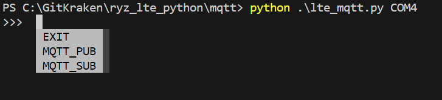

All messages use the `renesas/lte_mqtt` topic.

### MQTT_SUB

To subscribe to the `renesas/lte_mqtt` topic, use the `MQTT_SUB` command. Once initiated, the appropriate AT commands are issued to connect with the broker and subscribe to the topic. A message sequence chart will be printed to the terminal illustrating the AT commands used and the corresponding responses from the modem.

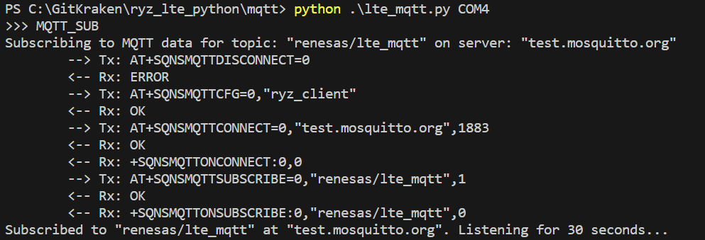

Once the subscription is established, open a second terminal and use the mosquitto CLI to publish a message to the `renesas/lte_mqtt` topic:

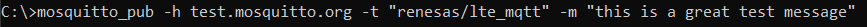

Verify you receive the message in python:

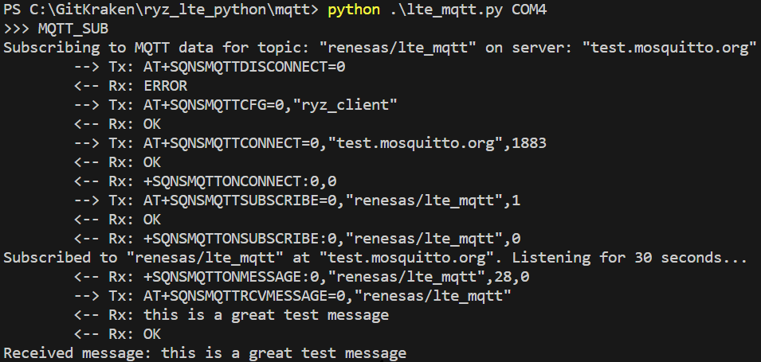

By default the script listens for messages for 30 seconds. You can pass an alternate timeout with the `MQTT_SUB` command: 

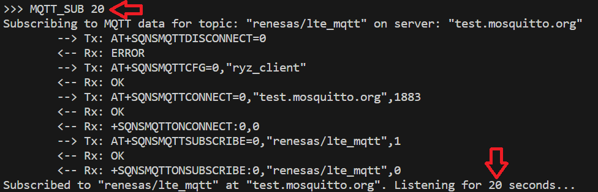

Once the timeout expires, the script will disconnect from the broker:

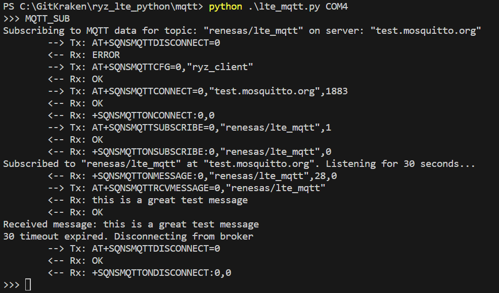

### MQTT_PUB

To publish to the `renesas/lte_mqtt` topic, use the `MQTT_PUB` command. Once initiated, the appropriate AT commands are issued to connect with the broker. If a connection with the broker is established, a prompt will appear which will allow you to enter a message to publish. A message sequence chart will be printed to the terminal illustrating the AT commands used and the corresponding responses from the modem.

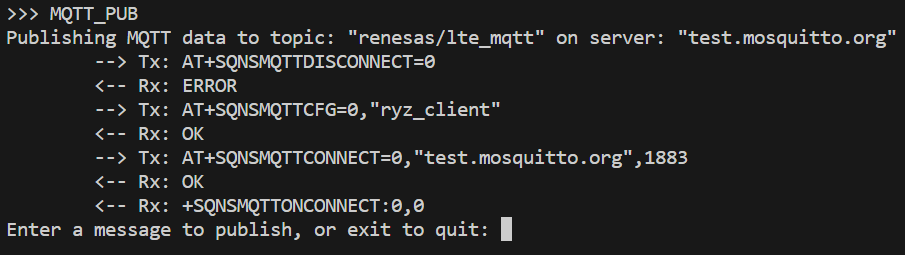

Before publishing a message, open a second terminal and use the mosquitto CLI to subscribe to the `renesas/lte_mqtt` topic:

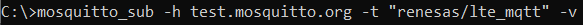

Next, enter a message to publish:

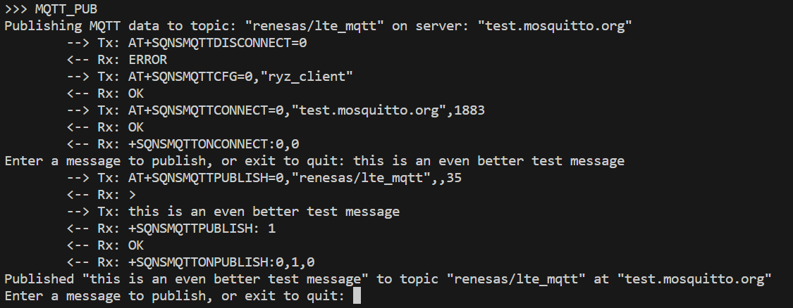

Verify you receive the message with the mosquitto CLI:

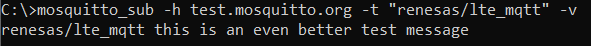

When you are done publishing messages, enter `exit` into the prompt:

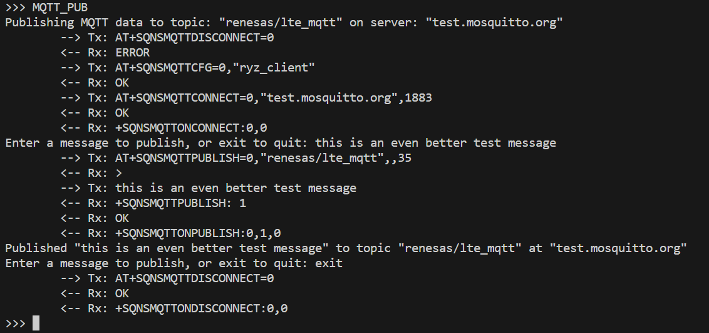