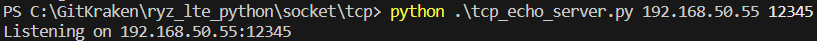
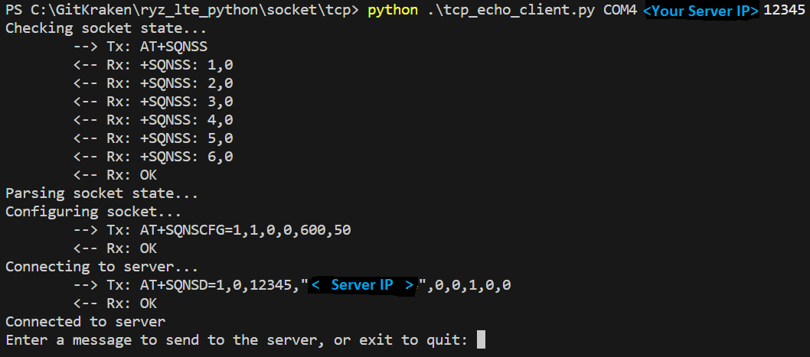
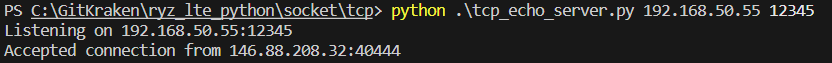
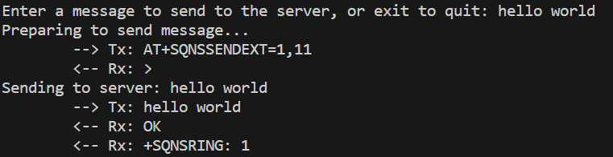
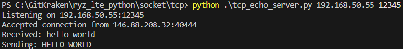
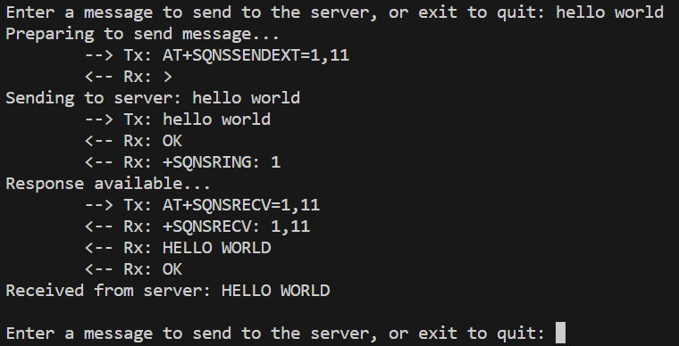
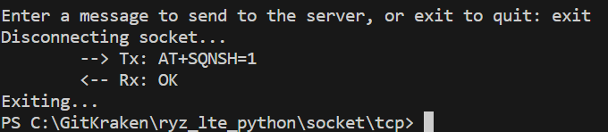

# lte_mqtt.py

Simple scripts to act as a TCP echo client/server.

The purpose of this script is to demonstrate using TCP sockets.

## Hardware Setup

This example requires a PMOD expansion board for [RYZ024A](https://www.renesas.com/us/en/products/wireless-connectivity/cellular-iot-modules/rtkyz024a0b00000be-pmod-expansion-board-ryz024a) or [RYZ014A](https://www.renesas.com/us/en/products/wireless-connectivity/cellular-iot-modules/rtkyz014a0b00000be-pmod-expansion-board-ryz014a).

In addition, a USB to UART converter is required to send AT commands from your PC to the PMOD expansion board over the USB port of your PC.

The UART_TX, UART_RX, and GND pins of your USB to UART converter should be connected to PMOD expansion board. In addition, connect the UART_CTS and UART_RTS pins if you are using UART flow control.

> **_NOTE:_** It is recommended to use flow control to prevent loss of data

Finally, power can be applied to the PMOD expansion board either by connecting to the micro USB connector or by applying 5V to the PMOD interface.

Below is the pinout of the PMOD:

## Running the script

This example uses two python scripts. `tcp_echo_client.py` will open a client socket using the LTE modem. `tcp_echo_server.py` will setup an echo server on your PC.

> **_NOTE:_** if your PC is not directly connected to the internet (e.g its running behind a router), you will need to setup [port forwarding](https://en.wikipedia.org/wiki/Port_forwarding) on your router to communicate with the LTE modem.

You can run server script with:

`python tcp_echo_server.py <server_ip> <server_port>`

where:
- `<server_ip>` is the IP address of your server.
**_NOTE:_** If your PC is not directly connected to the internet (e.g its running behind a router), this is the IP address of your **PC on your local network**.
- `<server_port>` is the IP address of your server.

You can run client script with:

`python tcp_echo_client.py <com_port> <server_ip> <server_port>`

where:
- `<com_port>` is the COM port associated with your USB to serial converter
- `<server_ip>` is the IP address of your server.
**_NOTE:_** If using port forwarding, this is the IP address of your **router**.
- `<server_port>` is the IP address of your server.

To run with flow control enabled on the serial port use:

`python tcp_echo_client.py --flow_cntrl <com_port> <server_ip> <server_port>`

To start, first run the server script. This will open a listening soocket on the IP/port of your choice:

Next, run the client script. This will configure a TCP socket and attempt to connect to your server. Once you are connected to the server, you are prompted to enter a message to send to the server:

**_NOTE:_** If using port forwarding, the IP address you pass should be the IP of your **router**.

You should also be able to verify with the server script that a connection has been made:

Next, send a message using the client script:

Verify your message is received at the server:  

The server simply capitalizes the message and echos it back to the client. Verify you receive the message back at the client:

When you are done sending messages, you can close the socket by typing `exit` in the the client script. This will shutdown the socket:

